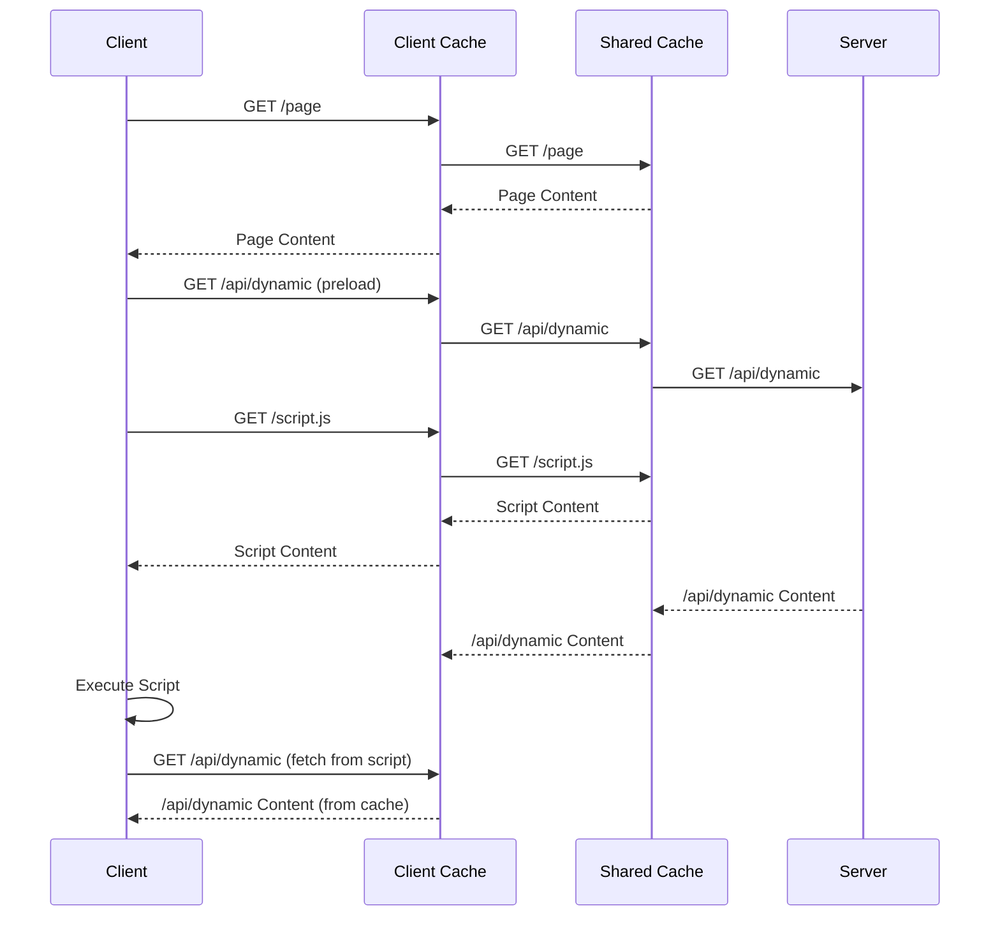

# SolidStart Example: SSR Publicly Cacheable Content And Preload Dynamic Content

This repo is a SolidStart port of [this TanStack example](https://github.com/NawfelBgh/tanstack-start-example-ssr-cacheable-preload-dynamic/). It demonstrates the pattern of server-side rendering publicly-cacheable page content, while using `<link rel="preload">` tags to accelerate the fetching of non-cacheable user-specific content.

`<link rel="preload">` tags allow preloading dynamic page data as soon as the client loads the page's head element and before any script is loaded. This gives performance similar to and sometimes better than streaming the whole page content due to better cache efficiency. See [comparison article](https://nawfelbgh.github.io/blog/when-pre-loading-beats-streaming-the-caching-advantage/).



If the server takes a long time to respond to the preloading fetch, and the script ends up fetching the same URL before the preload is finished, the browser does not send a second request. Instead, it waits for the preload to finish and reuses its response. All major browsers conform to this behavior, which the [spec](https://html.spec.whatwg.org/multipage/links.html#link-type-preload) describes in opaque terms:

> To consume a preloaded resource [...]
>
> 9. If entry's response is null, then set entry's on response available to onResponseAvailable.
> 10. Otherwise, call onResponseAvailable with entry's response.

---

This repo contains 2 versions:

- One using classic API routes to get dynamic content, on the branch [main](https://github.com/NawfelBgh/solid-start-example-ssr-cacheable-preload-dynamic/tree/main), and
- One using server functions to get them, on the branch [preload-server-functions](https://github.com/NawfelBgh/solid-start-example-ssr-cacheable-preload-dynamic/tree/preload-server-functions).

## Server functions version

### Limitations

Today, SolidStart server function implementation has limitations that prevent using them with `<link rel="preload">` tags:

- The server functions' server-side implementation only returns content when the header `X-Server-Instance` is sent.
    - This repo works around this issue using [patch-package](https://www.npmjs.com/package/patch-package) with [the provided patch](patches/@solidjs+start+2.0.0-alpha.2.patch#L9)
- The server functions' client-side implementation generates requests that are different from those created by `<link rel="preload">`, preventing browsers from reusing the preloaded content.
    - The differences are:
        - The added headers `X-Server-Id` and `X-Server-Instance`
        - Not including credentials (Cookie), which is the default behavior for `fetch`.
    - It also fetches in `cors` mode (the default mode for `fetch`), meaning that we must match it by using `<link rel="preload" crossorigin="use-credentials" as="fetch" href="...">`. This works perfectly fine in Chromium-based browsers and in Firefox. But [Safari does not reuse cross-origin preloads](https://stackoverflow.com/a/63814972).
    - This repo works around these issues using [patch-package](https://www.npmjs.com/package/patch-package) with [the provided patch](patches/@solidjs+start+2.0.0-alpha.2.patch#L22)
- Server functions do not provide a way to get their URLs with given parameters, which is needed to construct preload URLs. Currently, only the `serverFn.url` attribute is provided which only works for preloading GET server functions with no parameters.
    - This repo works around this issue by [manually calling seroval to serialize parameters](src/utils/users.tsx#L53).

This means that to use the SSR-cacheable-content/preload-dynamic-content pattern today, we must either use normal API routes, as demonstrated on the branch [main](https://github.com/NawfelBgh/solid-start-example-ssr-cacheable-preload-dynamic/tree/main), or turn to fragile workarounds to implement it using server functions. This repo aims to document the limitations and appeal to SolidStart maintainers to address them in a future release.

### Implementation details

- The app [defines](src/utils/users.tsx) two server functions for getting dynamic user-specific information:
    - `fetchUser()` fetches user name and profile pic
    - `fetchUserLike(postId: string)` fetches whether the user likes a given post
- Both endpoints:
    - use cookies to get the user session,
    - use a 2-second setTimeout to simulate slow network loading, and
    - are accessed through [query](https://docs.solidjs.com/solid-router/reference/data-apis/query) wrapper from Solid Router for request deduplication.
- The page's [/(layout).tsx](src/routes/(layout).tsx) inserts a preload tag to the head of the page to preload `fetchUser` when rendered on the server. On the client, it renders the [UserInfo](src/components/UserInfo.tsx) component which calls `fetchUser` reusing the already preloaded content.
- Likewise, the page [/(layout)/posts/[postId].tsx](src/routes/(layout)/posts/[postId].tsx) inserts a preload tag to the head of the page to preload `fetchUserLike` when rendered on the server. On the client, it renders the [UserLike](src/components/UserLike.tsx) component which calls `fetchUserLike` reusing the already preloaded content.
- On client-side navigation, dynamic page data is loaded by route preloaders, instead of relying on `<link rel="preload">` tags. This way, page prefetching on link hover does take into account the dynamic data.
- All pages set the Cache-Control header to `public, max-age=600` using the [HttpHeader](https://docs.solidjs.com/solid-start/reference/server/http-header) component.

### Other issues found

- The component [HttpHeader](https://docs.solidjs.com/solid-start/reference/server/http-header) does not set page headers, neither in dev (`npm run dev`) nor in production mode (`npm run preview`).

- The [catch-all route](src/routes/(layout)/[[...404]].tsx), defined inside the `(layout)` directory, works correctly for `/non-existent` but not for `/posts/2/non-existent`.

- When the server is just started, if we visit `/posts/1`, the HTML contains twice the preload link tag with `rel="preload" href="/api/user"` and the preload for `/api/post/1/like` is absent. On subsequent requests to `/posts/1` (for post ID `1` or any other post ID), the problem clears itself up and both preload link tags (for `/api/user` and `/api/post/1/like`) are present in the HTML.

## Getting Started

From your terminal:

```sh
npm install
npm run dev
```

This starts your app in development mode, rebuilding assets on file changes.

## Build

To build the app for production:

```sh
npm run build
```
