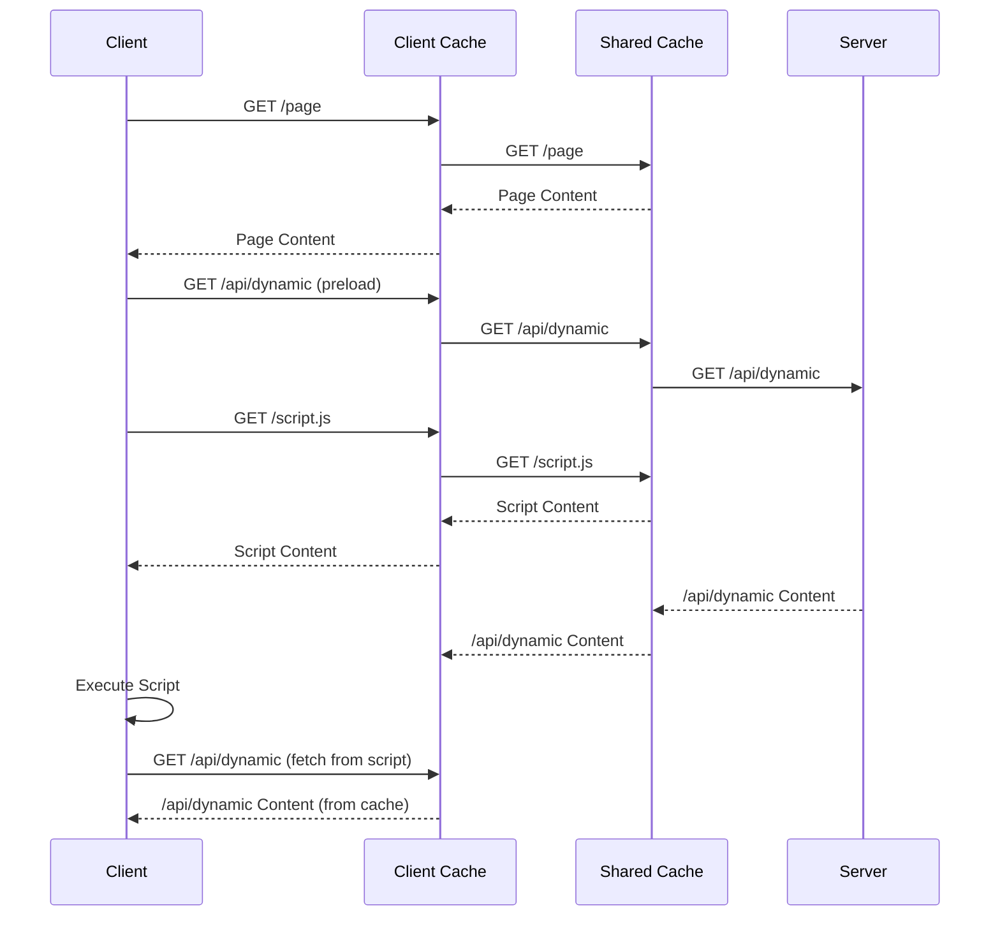

# Solid 2 Example: SSR Publicly Cacheable Content And Preload Dynamic Content

A Solid 2 (SolidJS 2.0, start mode) port of [this TanStack example](https://github.com/NawfelBgh/tanstack-start-example-ssr-cacheable-preload-dynamic/). It demonstrates the pattern of server-side rendering publicly-cacheable page content, while using `<link rel="preload">` tags to accelerate the fetching of non-cacheable user-specific content.

`<link rel="preload">` tags allow preloading dynamic page data as soon as the client loads the page's head element and before any script is loaded. This gives performance similar to and sometimes better than streaming the whole page content due to better cache efficiency. See [comparison article](https://nawfelbgh.github.io/blog/when-pre-loading-beats-streaming-the-caching-advantage/).


```mermaid
sequenceDiagram
    participant Client
    participant ClientCache as Client Cache
    participant SharedCache as Shared Cache
    participant Server

    Client->>ClientCache: GET /page
    ClientCache->>SharedCache: GET /page
    SharedCache-->>ClientCache: Page Content
    ClientCache-->>Client: Page Content

    Client->>ClientCache: GET /api/dynamic (preload)
    ClientCache->>SharedCache: GET /api/dynamic
    SharedCache->>Server: GET /api/dynamic

    Client->>ClientCache: GET /script.js
    ClientCache->>SharedCache: GET /script.js
    SharedCache-->>ClientCache: Script Content
    ClientCache-->>Client: Script Content

    Server-->>SharedCache: /api/dynamic Content
    SharedCache-->>ClientCache: /api/dynamic Content

    Client->>Client: Execute Script

    Client->>ClientCache: GET /api/dynamic (fetch from script)
    ClientCache-->>Client: /api/dynamic Content (from cache)
```

If the server takes a long time to respond to the preloading fetch, and the script ends up fetching the same URL before the preload is finished, the browser does not send a second request. Instead, it waits for the preload to finish and reuses its response. All major browsers conform to this behavior, which the [spec](https://html.spec.whatwg.org/multipage/links.html#link-type-preload) describes in opaque terms:

> To consume a preloaded resource [...]
>
> 9. If entry's response is null, then set entry's on response available to onResponseAvailable.
> 10. Otherwise, call onResponseAvailable with entry's response.

---

## Solid 2 server functions as a native preload target

- The client GET transport fetches `/_server/data/<id>?args=<json>`, and adds an `X-Server-Function-Instance` header to every request (it keeps client calls consistent with the SSR-rendered page). A `<link rel="preload" as="fetch">` cannot set custom headers, so without intervention the preload request and the real call differ and the preload response is not reused.
- This repo patches `@solidjs/web@2.0.0-rc.8` with [`patch-package`](https://www.npmjs.com/package/patch-package) — the `postinstall` script applies [`patches/@solidjs+web+2.0.0-rc.8.patch`](patches/@solidjs+web+2.0.0-rc.8.patch), which drops the instance header from the client transport and neutralizes it server-side (`instance: "noop"`). Preloads and real calls then share the exact same URL and headers, so the browser HTTP cache reuses the preloaded response for the later `fetch` from the script.
- The server responds based on the URL shape alone (`/_server/data/<id>` is the scripted transport address), so preload requests are served identically to real calls.
- Function ids are stable (`GET(fn).id`) and arguments use the same JSON-args encoding the transport produces, so preload URLs can be built ahead of time with [`serverFunctionDataHref`](src/utils/users.tsx) — no full serialization library needed.

## Implementation details

- The app [defines](src/utils/users.tsx) two `GET`-declared server functions for getting dynamic user-specific information:
  - `fetchUser()` fetches user name and profile pic
  - `fetchUserLike(postId: string)` fetches whether the user likes a given post
- Both endpoints:
  - use cookies to get the user session,
  - use a 2-second `setTimeout` to simulate slow network loading, and
  - are accessed through [query](https://solidjs.com/docs/router/latest/reference/data-apis/query) wrapper from Solid Router for request deduplication.
- The page's [/(layout).tsx](src/routes/(layout).tsx) inserts a preload tag to the head of the page to preload `fetchUser` when rendered on the server. On the client, it renders the [UserInfo](src/components/UserInfo.tsx) component which calls `fetchUser` reusing the already preloaded content.
- Likewise, the page [/(layout)/posts/[postId].tsx](src/routes/(layout)/posts/[postId].tsx) inserts a preload tag to the head of the page to preload `fetchUserLike` when rendered on the server. On the client, it renders the [UserLike](src/components/UserLike.tsx) component which calls `fetchUserLike` reusing the already preloaded content.
- On client-side navigation, dynamic page data is loaded by route preloaders, instead of relying on `<link rel="preload">` tags. This way, page prefetching on link hover does take into account the dynamic data.
- All pages set the Cache-Control header to `public, max-age=600` using the [httpHeader](https://v2.solidjs.com/reference/) declaration from `@solidjs/web`.

## Getting Started

From your terminal:

```sh
npm install
npm run dev
```

This starts your app in development mode, rebuilding assets on file changes. The `postinstall` script applies the `@solidjs/web` patch automatically.

## Build

To build the app for production:

```sh
npm run build
npm run serve
```